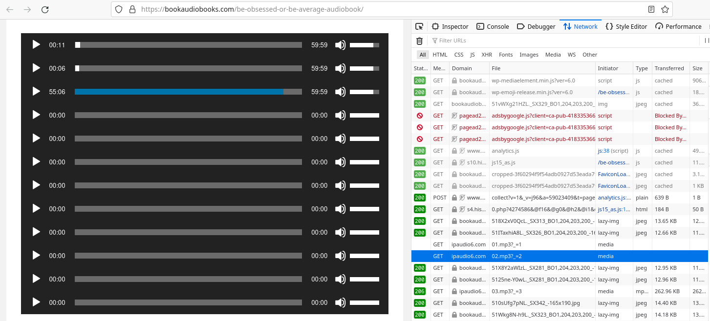

## Идея

Мне нужно было скачать все аудиофайлы cо страницы с плеером (опции "скачать" нет), чтобы позже склеить их в одну аудиодорожку с помощью `ffmpeg`.

При нажатии на кнопку воспроизведения в Newtwork Monitor отображается GET-запрос. ПКМ по строке --> Copy --> Copy URL



В моём случае, было 12 однотипных ссылок вида `https://.../XX.mp3?_=N`, где Х - это коды [01,02,...09,10,11,12], N - числа [1,2,...12].

Сразу родилась идея создать JSON-файл со списком URL, чтобы далее скачать всё с помощью скрипта.

На основе строки `https://ipaudio6.com/wp-content/uploads/BOOKAUDIO/Be%20Obsessed%20or%20Be%20Average/01.mp3?_=1` с помощью макроса Vim (`yyp$F/lvef=lveF=lvw`) сгенерировал [набор](urls.json) нужных адресов.

После этого приступил к созданию [скрипта](download_audio_using_url.py).

### UPD

Нужно парсить URL со страницы из тегов:
```html
<audio class="wp-audio-shortcode" id="audio-1939-1" preload="none" style="width: 100%;" controls="controls"><source type="audio/mpeg" src="https://ipaudio6.com/wp-content/uploads/BOOKAUDIO/Habits%20of%20Highly%20Effective%20Peop/01.mp3?_=1" /><a href="https://ipaudio6.com/wp-content/uploads/BOOKAUDIO/Habits%20of%20Highly%20Effective%20Peop/01.mp3">https://ipaudio6.com/wp-content/uploads/BOOKAUDIO/Habits%20of%20Highly%20Effective%20Peop/01.mp3</a></audio>
```
